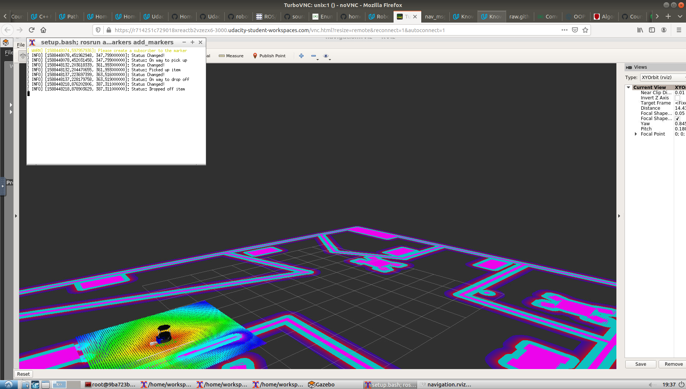

# Home_service_robot_1
A turtlesim robot capable of executing SLAM and navigating to waypoints to pickup or deliver objects in virtual world (Gazebo)

Home service robot picking virtual object


Home service robot dropping virtual object

## Topics covered

  - SLAM (Simultaneous Localisation and Mapping)
  - Localization and Navigation
  - Navigation Goal Node

## Project Aim :
1) Simulation setup for interfacing robot with different ROS packages, some of which are official ROS packages and others are packages that are created.

2) Map the environment of the Gazebo world with slam gmapping (Patience required).

3) Localization and Navigation testing where the robot is instructed to go to the pick up and drop off zones in the Gazebo world. Localization is done by AMCL and Navigation trajectory is done by ROS Navigation stack, which is based on Dijkstra's. 

4) Navigation Goal Node where a node is written that will communicate with the ROS Navigation stack and autonomously sending successive goals for the robot to reach. 

5) Simulating a Home service robot where the robot navigates to pick up and deliver virtual objects (using markers).

6) Writing shell scripts to execute home service simulation.

## Getting Started
To view this project, you must have Gazebo and ROS installed on Linux.

[Click here for Gazebo download and installation instructions](http://gazebosim.org).
 
[Click here for ROS installation instructions](http://wiki.ros.org/ROS/Installation).

To begin, make sure all relevant packages are up-to-date and install xterm :

```
$ sudo apt-get update && sudo apt-get upgrade -y
$ sudo apt-get install xterm
```

Next, clone the repository:

```
$ git clone --recurse-submodules https://github.com/sourabhmisal/Home_service_robot_1.git
```

Then navigate up to the root level (e.g. ```catkin_ws``) directory, and execute:

```
$ catkin_make
$ source devel/setup.bash
```

### Part 1: SLAM
This is a demonstration of robot performing SLAM. To perform SLAM, run the ```test_slam.sh``` script:

```
$ ./test_slam.sh
```
Four xterm terminals will automatically open (this may take a few seconds). You will see the robot in Rviz in what looks like a fairly blank map. To operate the robot, click on the window for the ```keyboard_teleop``` node, and follow the commands there. As the robot moves around the world, the map will begin to appear in Rviz. Since the world used is a bit complex, do it slowly and cover all the locations in a pattern. (Complete map generated from SLAM will be published shortly..) 

### Part 2: Navigation
This is a demonstration of robot performing navigation. To test the robot's navigation capabilities, run the ```test_navigation.sh``` script:

```
$ ./test_navigation.sh
```
Three xterm terminals will open (this may take a few seconds). This time you'll see the robot in a completed map in Rviz (The map used is not from SLAM, navigation with map generated from SLAM will be done shortly..). Click the "2D Nav Goal" button and click/drag somewhere on the map to command the robot. The robot will find a path to the goal location and follow it.

### Part 3: Full Service
We have seen the world is mapped and the robot can navigate. The robot is instructed to pick up and drop off a virtual object at different waypoints. To do this, run the ```home_service.sh``` script:

```
$ ./home_service.sh
```

An item (represented by a blue cube) will show up in Rviz. The robot will navigate to the item, at which point it will disappear (indicating it has been picked up), and then the robot will navigate to another point and drop off the item, at which point the item will reappear.
